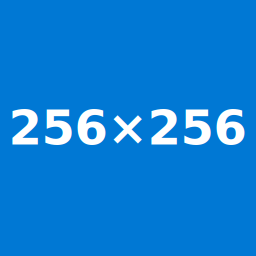
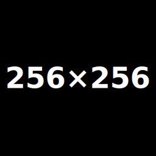
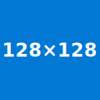
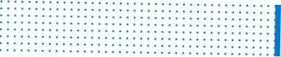

# 🖥️📱 Responsive design on GFM

## ⚠️ Issue
**GitHub Flavored Markdown (GFM)** has a syntax that limits the possibilities for designing advanced Markdown layouts due to significant security concerns : 
* **CSS spreadsheets and `<style>` elements are not allowed.**
* **JavaScript code and `<script>` elements are not allowed.**

Indeed, that would cause obvious **XSS** or **clickjacking** security issues.

## ✅ Solutions

While the first idea is that it isn't possible to create a responsive and advanced Markdown design in GFM because of the related security issues, there are still a lot of **tricks** that can be used to achieve such design. Here are the tricks that you use:

### Responsive sizing, positioning and theming

> [!IMPORTANT]
> The "**viewBox**" attribute resizes and scales SVG images relative to the defined **"viewBox" coordinates and the natural dimensions** of the SVG image.  
> If you want SVG images to **fit and adjust to the size of the parent preview container** when you set custom "**width**" or "**height**" attributes, **you must remove the "viewBox" attribute from the SVG image**. 

#### Responsive sizing with ``
- `` supports `width` and `height` attributes.
  - Example: `` **stretches the image to the parent container width**. In GitHub, using `width="100%"` will make the image fill the preview container width.

<details>
<summary>Examples (expand)</summary>

```html
<!-- This will stretch the provided image according to the fixed "width" and "height" attributes -->

```


```html
<!-- This will stretch the provided image to the full parent container width with a fixed and defined height -->

```


```html
<!-- This will stretch the image to the full parent container width maintaining aspect ratio -->

```

</details>

#### Responsive & adaptive theming with `<picture>`

> [!NOTE]
> Color theme selection will depend on two factors:
> - If the user is logged in, the color theme defined in the GitHub user settings will be used.
> - If the user is not logged in, the browser / operating system color theme will be used.

- Use `<picture>` with `<source>` elements to provide multiple resolutions and theme variants.
  - Serve **different resolutions** via `media` queries (e.g., `(max-width: 600px)`).
  - Provide **dark/light variants** using `media="(prefers-color-scheme: dark)"` and `media="(prefers-color-scheme: light)"`.

<details>
<summary>Examples (expand)</summary>

```html
<!-- Change shown image based on device screen width with media queries -->
<picture>
  <source media="(max-width: 1023px)" srcset="metadata-assets/responsive-md/placeholders/256x256-0078D4-FFFFFF.svg">
  <source media="(min-width: 1024px)" srcset="metadata-assets/responsive-md/placeholders/512x256-0078D4-FFFFFF.svg">
  
</picture>
```

<picture>
  <source media="(max-width: 1023px)" srcset="metadata-assets/responsive-md/placeholders/256x256-0078D4-FFFFFF.svg">
  <source media="(min-width: 1024px)" srcset="metadata-assets/responsive-md/placeholders/512x256-0078D4-FFFFFF.svg">
  
</picture>

```html
<!-- Switch between dark and light themes -->
<picture>
  <source media="(prefers-color-scheme: dark)" srcset="metadata-assets/responsive-md/placeholders/256x256-000000-FFFFFF.svg">
  <source media="(prefers-color-scheme: light)" srcset="metadata-assets/responsive-md/placeholders/256x256-FFFFFF-000000.svg">
  
</picture>
```

<picture>
  <source media="(prefers-color-scheme: dark)" srcset="metadata-assets/responsive-md/placeholders/256x256-000000-FFFFFF.svg">
  <source media="(prefers-color-scheme: light)" srcset="metadata-assets/responsive-md/placeholders/256x256-FFFFFF-000000.svg">
  
</picture>

```html
<!-- Switch between dark and light themes, with full-width responsive rectangle design -->
<picture>
  <source media="(prefers-color-scheme: dark)" srcset="metadata-assets/responsive-md/placeholders/FULLx32-000000-FFFFFF.svg">
  <source media="(prefers-color-scheme: light)" srcset="metadata-assets/responsive-md/placeholders/FULLx32-FFFFFF-000000.svg">
  
</picture>
```

<picture>
  <source media="(prefers-color-scheme: dark)" srcset="metadata-assets/responsive-md/placeholders/FULLx32-000000-FFFFFF.svg">
  <source media="(prefers-color-scheme: light)" srcset="metadata-assets/responsive-md/placeholders/FULLx32-FFFFFF-000000.svg">
  
</picture>
</details>

> A lot of media queries can be used: https://developer.mozilla.org/en-US/docs/Web/CSS/Guides/Media_queries/Using

#### Alignment
- Align `` and `<p>` with the `align` property: **left, center, right**

<details>
<summary>Examples (expand)</summary>

```md
### align="left"

Left alignment

### align="right"

Right alignment
```

### align="left"

Left alignment

### align="right"

Right alignment

```html
<p align="left">
  
  
</p>

<p align="center">
  
  
</p>

<p align="right">
  
  
</p>
```

<p align="left">
  
  
</p>

<p align="center">
  
  
</p>

<p align="right">
  
  
</p>

```html
<table align="left">
  <thead>
    <tr>
      <th>First header</th>
      <th>Second header</th>
    </tr>
  </thead>
  <tbody>
    <tr>
      <td>Content</td>
      <td>Content</td>
    </tr>
    <tr>
      <td>Content</td>
      <td>Content</td>
    </tr>
  </tbody>
</table>

<table align="center">
  <thead>
    <tr>
      <th>First header</th>
      <th>Second header</th>
    </tr>
  </thead>
  <tbody>
    <tr>
      <td>Content</td>
      <td>Content</td>
    </tr>
    <tr>
      <td>Content</td>
      <td>Content</td>
    </tr>
  </tbody>
</table>

<table align="right">
  <thead>
    <tr>
      <th>First header</th>
      <th>Second header</th>
    </tr>
  </thead>
  <tbody>
    <tr>
      <td>Content</td>
      <td>Content</td>
    </tr>
    <tr>
      <td>Content</td>
      <td>Content</td>
    </tr>
  </tbody>
</table>
```

<table align="left">
  <thead>
    <tr>
      <th>First header</th>
      <th>Second header</th>
    </tr>
  </thead>
  <tbody>
    <tr>
      <td>Content</td>
      <td>Content</td>
    </tr>
    <tr>
      <td>Content</td>
      <td>Content</td>
    </tr>
  </tbody>
</table>

<br/>
<br/>
<br/>
<br/>
<br/>
<br/>

<table align="center">
  <thead>
    <tr>
      <th>First header</th>
      <th>Second header</th>
    </tr>
  </thead>
  <tbody>
    <tr>
      <td>Content</td>
      <td>Content</td>
    </tr>
    <tr>
      <td>Content</td>
      <td>Content</td>
    </tr>
  </tbody>
</table>

<br/>

<table align="right">
  <thead>
    <tr>
      <th>First header</th>
      <th>Second header</th>
    </tr>
  </thead>
  <tbody>
    <tr>
      <td>Content</td>
      <td>Content</td>
    </tr>
    <tr>
      <td>Content</td>
      <td>Content</td>
    </tr>
  </tbody>
</table>

<br/>
<br/>
<br/>
<br/>
<br/>

</details>

---

### SVG-based techniques

Because of their **vector** nature, SVG files allow for **very advanced layouts**. Keep markup inside the `.svg` file and reference it from Markdown inside a `img` element.

#### Styling (`<style>` inside SVG)

> [!WARNING]
> Due to a [**WebKit long-lasting issue**](https://bugs.webkit.org/show_bug.cgi?id=199134), the **prefers-color-scheme** media query **doesn't work when embedded inside a SVG in Safari**.  
> The `<style>` element work, but not the **prefers-color-scheme** media query.  
> **A workaround exists in the GFM syntax for maximum cross-browser interoperability**.  
> Please refer to the [**Responsive & adaptive theming with `<picture>`**](#responsive--adaptive-theming-with-picture) section.

- **Styling** inside the SVG (`<style>`) applies only within the SVG. Consequence ? This is not stripped out by GFM processor.

<details>
<summary>Example (expand)</summary>

```xml
<svg xmlns="http://www.w3.org/2000/svg" version="1.1" width="256" height="100" viewBox="0 0 256 100">
  <style>
    .title {
      font: bold 20px '-apple-system', BlinkMacSystemFont, 'Segoe UI', 'Noto Sans', Helvetica, Arial, sans-serif, 'Apple Color Emoji', 'Segoe UI Emoji';
    }

    @media (prefers-color-scheme: dark) {
      .title {
        fill: #AFAFAFFF;
      }
    }

    @media (prefers-color-scheme: light) {
      .title {
        fill: #3A3A3AFF;
      }
    }
  </style>

  <text class="title" x="10" y="55">Styled inside SVG</text>
</svg>
```

```html

```


</details>

#### HTML inside SVG (`<foreignObject>`)
- Use `<foreignObject>` to include **HTML** inside the SVG.

<details>
<summary>Example (expand)</summary>

```xml
<svg xmlns="http://www.w3.org/2000/svg" version="1.1" viewBox="0 0 400 100">
  <style>
    .container {
      font-family: '-apple-system', BlinkMacSystemFont, 'Segoe UI', 'Noto Sans', Helvetica, Arial, sans-serif, 'Apple Color Emoji', 'Segoe UI Emoji';

      display: flex;
      justify-content: center;
      align-items: center;
      width: 100%;
      height: 100%;

      background-color: #0078D4;
      color: #FFFFFF;
      border-radius: 8px;
    }
  </style>

  <foreignObject x="0" y="0" width="400" height="100">
    <div xmlns="http://www.w3.org/1999/xhtml" class="container">
      <strong>Centered text inside SVG</strong>
    </div>
  </foreignObject>
</svg>
```

```html

```


</details>

#### Patterns, transforms & positioned elements
- Use `<pattern>` for **tiled backgrounds**; `transform` to **rotate/position elements**.

<details>
<summary>Example (expand)</summary>

```xml
<!-- Example with circle pattern tiling on the rectangle and a right-aligned element on top of it -->
<svg xmlns="http://www.w3.org/2000/svg" version="1.1" viewBox="0 0 400 82">
  <defs>
    <pattern fill="#0078D4" id="dots" width="10" height="10" patternUnits="userSpaceOnUse">
      <circle cx="2" cy="2" r="1.5" />
    </pattern>
  </defs>

  <rect width="100%" height="80" fill="url(#dots)" transform="rotate(1)"  />
  <rect width="8" height="74" fill="#0078D4" x="100%" transform="rotate(1) translate(-8,0)"  />
</svg>
```

```html

```


</details>

#### Adaptive sizing without proportional stretching
- Omitting `viewBox` and using `width` or `height` attributes can make the SVG **adapt to parent "preview" container sizing rather than stretching the whole image proportionally in width and height to the "viewBox" coordinates**. Furthermore, **without `viewBox`, the SVG and its elements will adapt to the defined "width" and "height" internal sizes, as well as to the current window size, just as a standard HTML document would**.

<details>
<summary>Example (expand)</summary>

```xml
<!-- Example combined with pattern tiling and full-width adaptive and responsive design -->
<svg xmlns="http://www.w3.org/2000/svg" version="1.1" width="100%" height="92">
  <defs>
    <pattern fill="#0078D4" id="dots" width="10" height="10" patternUnits="userSpaceOnUse">
      <circle cx="2" cy="2" r="1.5" />
    </pattern>
  </defs>

  <rect width="100%" height="80" fill="url(#dots)" transform="rotate(1)"  />
  <rect width="8" height="74" fill="#0078D4" x="100%" transform="rotate(1) translate(-8,0)"  />
</svg>
```

```html

```


</details>

---

### Anchors & navigation
- Use HTML anchors: `<a name="gate"></a>` and link with `#gate`.

<details>
<summary>Examples (expand)</summary>

```md
### The gate (HTML)
<a name="gate"></a>
...

### [Go to gate](#gate)
```

```md
### The gate (Markdown)
...

## [Go to gate](#the-gate-markdown)
```

### The gate (HTML)
<a name="gate"></a>
...

### [Go to gate](#gate)

### The gate (Markdown)
...

## [Go to gate](#the-gate-markdown)

</details>

If you combine all of these tricks, you can create quite an advanced GFM layout.


## 💡 Solving our [README.md](README.md) responsive issue

The goal we are trying to achieve here is to replicate the style of the VSCode tabs bar, but there are major design considerations to keep in mind:
* The tabs bar that lists active files contains a placeholder container that extends to the end of the view
* The action buttons must be placed at the end of the view, above the tabs bar
* These two components are repositioned and resized according to the window size
* Colors must adapt to dark/light themes.

### Implementation

1. **Create six SVG images "components"**  
   Repeat these steps for the dark / light themes:
   - `vscode-preview-tab.svg` — the active "preview" file tab (placed at the beginning of the image).
   - `vscode-tabs-bar-filler.svg` — the placeholder container tile pattern that will be repeated across the remaining width.
   - `vscode-editor-actions.svg` — action buttons (anchored to the right, placed above the placeholder container).

2. **Assemble the six themed SVG "components" inside two composites SVG images**  
   Create a composite image for each theme (dark / light) and associate each themed SVG component (dark / light) with the created image:
   - Place the `vscode-preview-tab.svg` image at `x=0`.
   - Define a `<pattern>` that uses `vscode-tabs-bar-filler.svg` to create a repeating tiled pattern with `width="1"` (1px). 
   - Draw a `<rect>` filled with `url(#<id-of-the-pattern>)` starting at `x=<[vscode-preview-tab.svg]-width>` and extending with `width="100%"`.
   - Add the `vscode-editor-actions.svg` image and use `x="100%"` with `transform="translate(-<[vscode-editor-actions.svg]-width>, 0)"` to anchor it to the end of the filler pattern.

3. **Sizing & responsiveness**  
   - Do **not** include `viewBox` to make the SVG scale to the parent container `width` dimensions (remove `viewBox`).
   - Use `width="100%"` when embedding the SVG in README inside an `img` element.

4. **Embedding in README**  
   Use the `<picture>` element to switch composite images between dark and light color themes:

   ```html
   <picture>
     <source media="(prefers-color-scheme: dark)" srcset="<link-to-composite-dark-themed-image.svg>" />
     <source media="(prefers-color-scheme: light)" srcset="<link-to-composite-light-themed-image.svg>" />
     " alt="Preview README.md" width="100%" />
   </picture>
   ```

## SVG

> [!IMPORTANT]
> **GitHub prohibits** (via its **Content Security Policy \[CSP\]**) the **loading of external resources and images** from an SVG for **security reasons**, so we use **base64-encoded images**, which are **inline and local** representations of the designed images.

### Composite dark-themed image

```xml
<svg xmlns="http://www.w3.org/2000/svg"
     xmlns:xlink="http://www.w3.org/1999/xlink"
     version="1.1"
     height="36">
  <defs>
    <!-- 1px tile filler pattern -->
    <pattern class="tile-filler" id="tile-filler-dark" width="1" height="100%" patternUnits="userSpaceOnUse">
      <!-- vscode-tabs-filler.svg -->
      <image width="1"
             height="36"
             preserveAspectRatio="none"
             xlink:href="data:image/svg+xml;base64,..." />
    </pattern>
  </defs>

  <!-- preview tab image: fixed box at x=0 -->
  <!-- vscode-preview-tab.svg -->
  <image class="preview-dark" 
         id="preview-tab-dark"
         width="164"
         height="36"
         xlink:href="data:image/svg+xml;base64,..." />

  <!-- tabs bar filler, starts from x = 164 (end of preview tab image) with a width of 100% (entire SVG width) -->
  <!-- as the width of the pattern is equal to 100% of the SVG image, the remaining width of the SVG image is effectively filled by the pattern -->
  <!-- if the image that references this SVG image has a width of 100%, the remaining screen width is effectively filled by the pattern -->
  <rect class="tabs-bar-filler" id="tabs-bar-filler-dark" x="164" y="0" width="100%" height="36" fill="url(#tile-filler-dark)" />

  <!-- editor actions image: positioned at the end of the view width (above the tabs bar filler) using offset translation with x=calc(100% - 90px) -->
  <!-- vscode-editor-actions.svg -->
  <image class="editor-actions" 
         id="editor-actions-dark"
         width="90"
         height="36"
         x="100%"
         transform="translate(-90,0)"
         xlink:href="data:image/svg+xml;base64,..." />
</svg>
```

### Composite light-themed image

```xml
<svg xmlns="http://www.w3.org/2000/svg"
     xmlns:xlink="http://www.w3.org/1999/xlink"
     version="1.1"
     height="36">
  <defs>
    <!-- 1px tile filler pattern -->
    <pattern class="tile-filler" id="tile-filler-light" width="1" height="100%" patternUnits="userSpaceOnUse">
      <!-- vscode-tabs-filler.svg -->
      <image width="1"
             height="36"
             preserveAspectRatio="none"
             xlink:href="data:image/svg+xml;base64,..." />
    </pattern>
  </defs>

  <!-- preview tab image: fixed box at x=0 -->
  <!-- vscode-preview-tab.svg -->
  <image class="preview-tab" 
         id="preview-tab-light"
         width="164"
         height="36"
         xlink:href="data:image/svg+xml;base64,..." />

  <!-- tabs bar filler, starts from x = 164 (end of preview tab image) with a width of 100% (entire SVG width) -->
  <!-- as the width of the pattern is equal to 100% of the SVG image, the remaining width of the SVG image is effectively filled by the pattern -->
  <!-- if the image that references this SVG image has a width of 100%, the remaining screen width is effectively filled by the pattern -->
  <rect class="tabs-bar-filler" id="tabs-bar-filler-light" x="164" y="0" width="100%" height="36" fill="url(#tile-filler-light)" />

  <!-- editor actions image: positioned at the end of the view width (above the tabs bar filler) using offset translation with x=calc(100% - 90px) -->
  <!-- vscode-editor-actions.svg -->
  <image class="editor-actions" 
         id="editor-actions-light"
         width="90"
         height="36"
         x="100%"
         transform="translate(-90,0)"
         xlink:href="data:image/svg+xml;base64,..." />
</svg>
```

## Markdown (GFM)

```html
<picture>
  <source media="(prefers-color-scheme: dark)" srcset="<link-to-composite-dark-themed-image.svg>" />
  <source media="(prefers-color-scheme: light)" srcset="<link-to-composite-light-themed-image.svg>" />
  " alt="Preview README.md" width="100%" />
</picture>
```

<picture>
  <source media="(prefers-color-scheme: dark)" srcset="https://github.com/Zemasterkrom/zemasterkrom-assets/blob/rev6-w3c-with-ps-white-logo-webkit-fix/header/dark-mode/vscode-tabs-bar.svg?raw=true" />
  <source media="(prefers-color-scheme: light)" srcset="https://github.com/Zemasterkrom/zemasterkrom-assets/blob/rev6-w3c-with-ps-white-logo-webkit-fix/header/light-mode/vscode-tabs-bar.svg?raw=true" />
  
</picture>